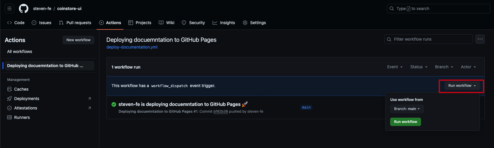

## workflow

每个`workflow`存储在单独的`YAML`配置文件里。

## YAML 配置文件

### name

名称显示在`Github 仓库 - Actions`；如果没有`name`，就用`YAML config filename`代替。

### run-name

工作流执行名称；如果没有设置`run-name`，则以`git commit-message`代替。

### on

```yml
on:
  push:
    branches: ['main']
    paths: ['src/**/*.mdx', 'src/**/*.stories.@(js|jsx|mjs|ts|tsx)']
```

`push`：触发的事件。

`branches`：触发时，满足的分支名称。

`paths`：触发时，这些文件需要有更改。

### workflow_dispatch

可以在`GitHub`页面手动触发`workflow`。如下图所示：

<p align="center"></p>

### permissions

设置 GITHUB_TOKEN 的权限。

#### contents

处理代码仓库的内容。

`contents: read`：读取`git commit`列表。

`contents: write`：创建`git commit`。

#### pages

使用 GitHub Pages。 例如，pages: write 允许操作请求 GitHub Pages 生成。

#### id-token

提取 OpenID Connect (OIDC) 令牌。 这需要 id-token: write。

### concurrency

在同一个`concurrency.group`中，只允许同时运行一个`workflow`。

#### cancel-in-progress

是否可以取消正在运行中的`workflow`。

### jobs

#### job-name

#### runs-on

#### steps

将所有在`jobs`中的步骤组合在一起。

##### uses

##### with

##### run

执行命令。例如：

```yaml
- run: npm install -g bats
- run: bats -v
```

## actions

### actions/checkout@v4

将仓库的代码复制到`workflow`

#### ref

指定`checkout`的`git branch`。

### actions/setup-node@v4

安装指定版本的`nodejs`

```yaml
- uses: actions/setup-node@v4
  with:
    node-version: '21'
```

### JamesIves/github-pages-deploy-action@v4

处理`github-pages`部署分支的action。

> 因为需要`git commit`，所以需要设置`permissions.contents: true`。

#### branch

提交代码的分支。默认为`gh-pages`。

#### folder

将哪个目录下的文件提交至`branch`分支。（必须设置项）

#### single-commit

在`branch`分支上，只存在一个`git commit`记录，减少git记录的体积。

#### clean
