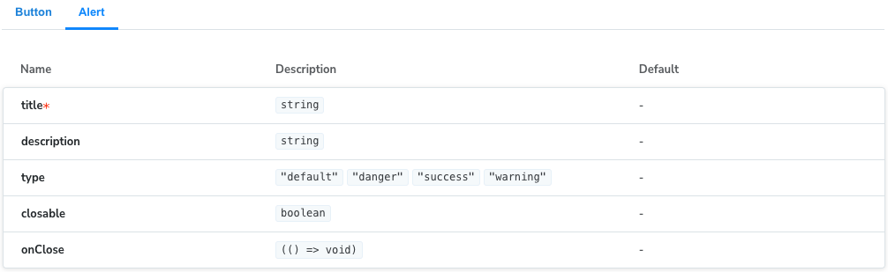
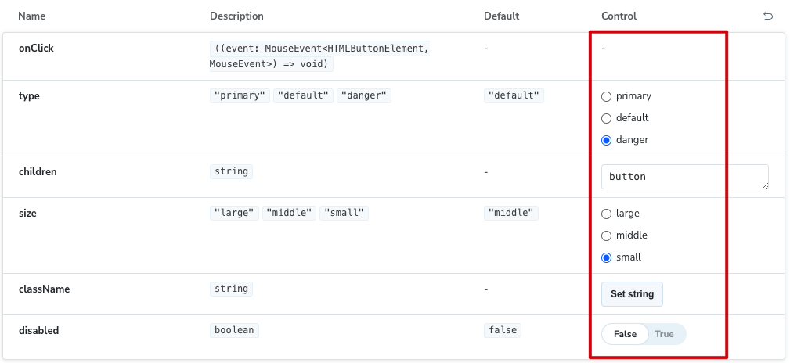
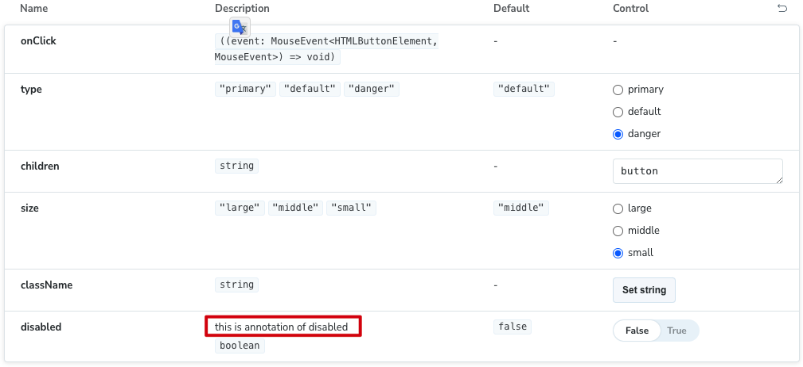

## excludeStories

使用 ”excludeStories“ 来排除某些不需要被 Storybook 渲染的导出。

Task.stories.tsx

```ts
export const ActionsData = {
  onArchiveTask: fn(),
  onPinTask: fn(),
};

const meta = {
  excludeStories: /.*Data$/, // 将上面的 ActionData 排除在 Storybook 渲染。
};

export default meta;
```

## id

stories 的 id ，用在 url 上。

## subcomponents

在组件参数列表中，显示子组件的参数。

```ts
import type { Meta } from '@storybook/react';
import { Button } from '../button';
import { Alert } from '../../alert/alert';

const meta = {
  subcomponents: { Alert: Alert as FC<unknown> },
  title: 'Component/Button',
  component: Button,
} satisfies Meta<typeof Button>;

export default meta;
```

如下图所示，不仅展示了 Button 参数列表，还可以展示 subComponent - Alert 的参数列表。

<p align="center"></p>

## argTypes

`argTypes` 指定 `组件参数 props` 的类型，例如：参数的类型、餐素的描述、参数值的修改控件等。

例如：

```ts
import type { Meta } from '@storybook/react';
import { Button } from '../button';

const meta = {
  title: 'Component/Button',
  component: Button,
  argTypes: {
    disabled: {
      control: 'boolean',
      description: 'disabled button',
    },
  },
} satisfies Meta<typeof Button>;

export default meta;
```

### control

可以控制 `参数值` 的修改控件，比如：boolean、check、color、date等。

- false - 不显示该 arg 的 control 。
- other - [详细内容 - https://storybook.js.org/docs/api/arg-types#control](https://storybook.js.org/docs/api/arg-types#control)

<p align="center"></p>

### description

为 DOCS - Description 列添加注释信息。

<p align="center"></p>

### if

根据另一个 arg 或全局变量的值有条件地渲染该 arg。

```ts
// Replace your-renderer with the renderer you are using (e.g., react, vue3, angular, etc.)
import type { Meta } from '@storybook/your-renderer';

import { Example } from './Example';

const meta: Meta<typeof Example> = {
  component: Example,
  argTypes: {
    parent: { control: 'select', options: ['one', 'two', 'three'] },

    // 👇 Only shown when `parent` arg exists
    parentExists: { if: { arg: 'parent', exists: true } },

    // 👇 Only shown when `parent` arg does not exist
    parentDoesNotExist: { if: { arg: 'parent', exists: false } },

    // 👇 Only shown when `parent` arg value is truthy
    parentIsTruthy: { if: { arg: 'parent' } },
    parentIsTruthyVerbose: { if: { arg: 'parent', truthy: true } },

    // 👇 Only shown when `parent` arg value is not truthy
    parentIsNotTruthy: { if: { arg: 'parent', truthy: false } },

    // 👇 Only shown when `parent` arg value is 'three'
    parentIsEqToValue: { if: { arg: 'parent', eq: 'three' } },

    // 👇 Only shown when `parent` arg value is not 'three'
    parentIsNotEqToValue: { if: { arg: 'parent', neq: 'three' } },

    // Each of the above can also be conditional on the value of a globalType, e.g.:

    // 👇 Only shown when `theme` global exists
    parentExists: { if: { global: 'theme', exists: true } },
  },
};

export default meta;
```

### table

指定 arg 如何被添加到 DOCS - Description 中

```ts
{
  category?: string;
  defaultValue?: {
    detail?: string;
    summary: string;
  };
  disable?: boolean;
  subcategory?: string;
  type?: {
    detail?: string;
    summary: string;
  };
}
```

- defaultValue - 在 docTable - Default 中显示的值
- disable - 是否显示该 arg
- type - 在 docTable - Description 中显示的值

[详细内容 - https://storybook.js.org/docs/api/arg-types#table](https://storybook.js.org/docs/api/arg-types#table)

### type

指定 arg 的类型。可以根据 type 值，推断出 control 和 table.type 。

## decorators

将 story 包裹在额外的 HTML 标签里。

```ts
import type { Meta } from '@storybook/react';
import { Button } from '../button';

const meta = {
  decorators: [
    (Story) => (
      <div style={{ margin: '3em' }}>
        {/* 👇 Decorators in Storybook also accept a function. Replace <Story/> with Story() to enable it  */}
        <Story />
      </div>
    ),
  ],
  title: 'Component/Button',
  component: Button,
} satisfies Meta<typeof Button>;

export default meta;
```

渲染后：

<p align="center"></p>

## parameters

### docs

#### subtitle

文档的副标题

#### description

##### component

文档的描述，需要使用 MarkDown 语法书写。
